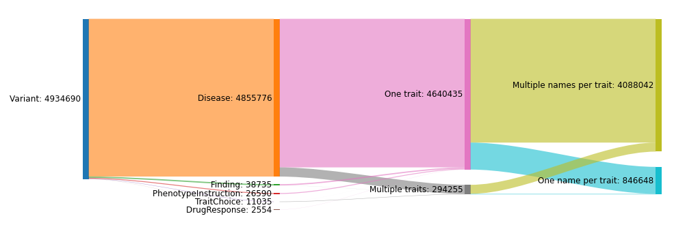
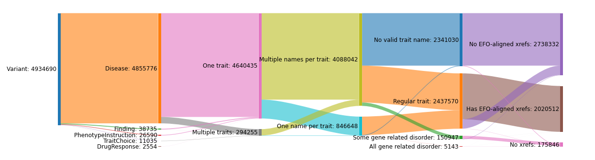
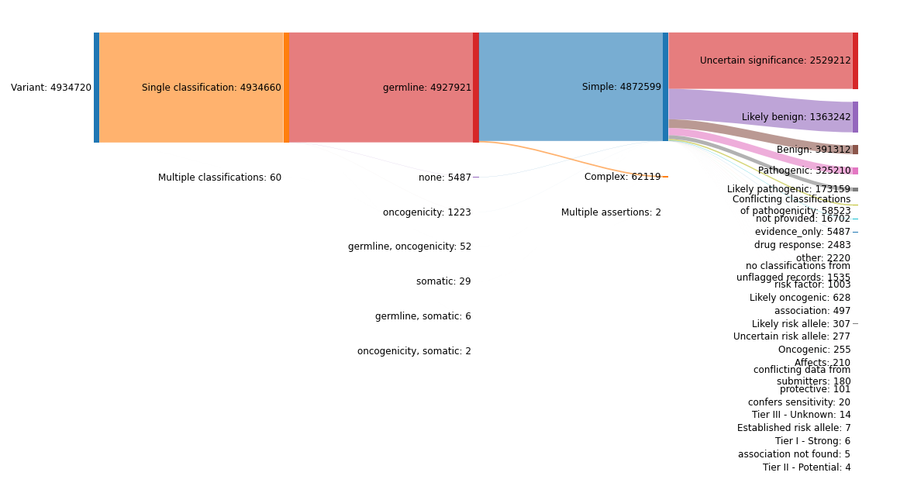
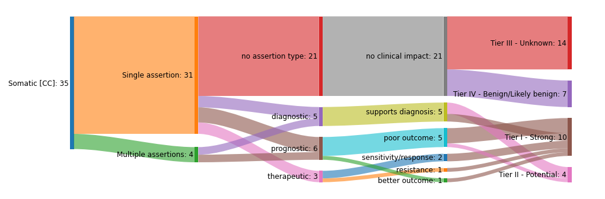
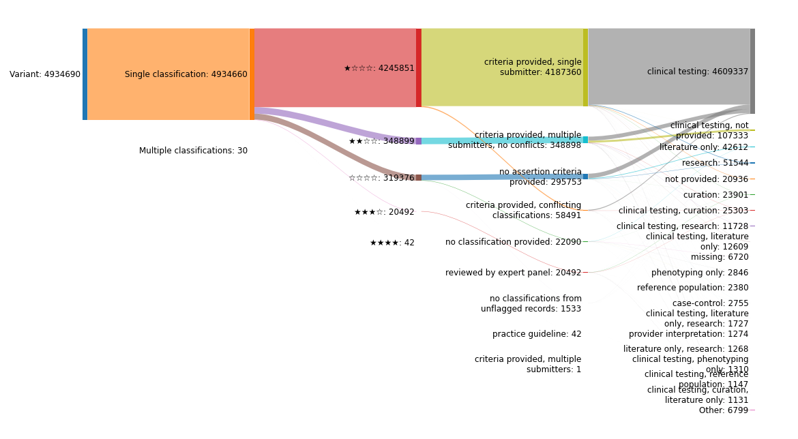
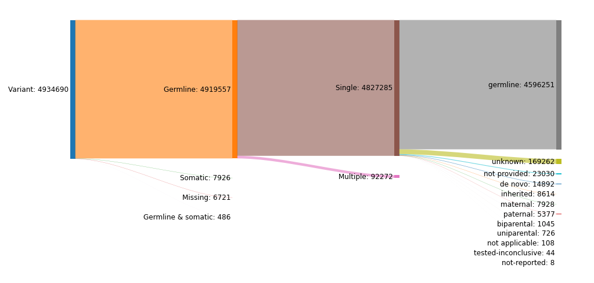

# ClinVar data model and attribute value distributions

The script in this directory parses the ClinVar XML data dump and constructs several diagrams and tables which illustrate how variation and disease data are represented. This helps guide the design of the pipeline and its output structure.

The data was last updated on **2025-09-04.** Graphs can be enlarged by clicking on them.


## Updating the data

```bash
wget -O clinvar.xml.gz https://ftp.ncbi.nlm.nih.gov/pub/clinvar/xml/RCV_release/ClinVarRCVRelease_00-latest.xml.gz
python3 clinvar-variant-types.py --clinvar-xml clinvar.xml.gz
```

The diagrams are generated directly by the code as PNG files.
In addition, the source code for diagrams and tables will be printed to STDOUT. The diagrams can then be built using the website http://sankeymatic.com/build/. Parameters for rendering them will be indicated in the output as well. The tables should be copy-pasted into the [corresponding Markdown file](supplementary-tables.md).


## Variation representation


**RCV** is the top level of ClinVar data organisation. It is a record which associates one or more traits (usually diseases) with exactly one _VCV record,_ which can be one of two types:
* **MeasureSet** contains one or more _Measures._ (Each Measure is essentially an individual, isolated variant.) The MeasureSet can be one of four types:
  - **Variant.** This means that the measure “set” has the size of 1 and contains just a single isolated variant. This variant can be one of the subtypes illustrated on the diagram.
  - Several other complex types, which were not investigated further in this analysis. They may contain multiple Measures (variants), which must all be interpreted together.
* **GenotypeSet** represents the cases when the variants which are interpreted together are located on different chromosomal copies (paternal/maternal), that is, when they include _trans_ phasing. The GenotypeSet can be one of two types, which were not investigated further in this analysis:
  - **CompoundHeterozygote.** Presumably this should include exactly two variants which are _trans_ phased and interpreted together.
  - **Diplotype.** Similar, but at least one of the _trans_ phased alleles includes a haplotype. An example of this would be three variants located on one copy of the gene, and one variant in the second one, all interpreted together.

The most common case is MeasureSet/Variant. **Currently, this is the only type being processed by this pipeline.** All following diagrams also examine distributions only within that record type.


## Trait representation



Each Variant record contains exactly one **trait set** of a particular type, which represents the nature of the traits combined within it, for example disease or drug response.

A trait set contains one or multiple **traits.**

In turn, each trait has one or multiple **names** (synonyms) assigned to it.

The diagram above demonstrates all these relationships. For a trait set with multiple traits, the rightmost part of the diagram means:
* “One name per trait” = _every_ trait in a trait set has at most one name;
* “Multiple names per trait” = at least one trait in a trait set has multiple names.



The traits are described with varying levels of informativeness, which is shown in the above diagram.

Some trait names we consider invalid as they do not describe anything meaningful (e.g. "not provided" or "disease").
Others are meaningful but less informative than specific disease terms, e.g. "CLCN4-related disorder" or other 
gene-related disorder terms. The diagram uses the following categories:
* "No valid trait names" = no trait in the trait set has any valid names
* "Some gene related disorder" = some (but not all) trait names within the trait set are gene-related disorder terms
* "All gene related disorder" = all valid trait names within the trait set are gene-related disorder terms
* "Regular trait" = all other traits

Finally, each trait also has one or multiple cross-references associated with it.
These are identifiers from ontologies like MONDO or databases like MedGen.

Of these we are especially interested in those that are "EFO-aligned", i.e. from EFO, MONDO, HP, and Orphanet.
The above diagram shows which records have such cross-references. For records with multiple traits:
* "No EFO-aligned xrefs" = no trait in the trait set has any EFO-aligned cross-references;
* "Has EFO-aligned xrefs" = at least one trait in the trait set has at least one EFO-aligned cross-reference.

Supplementary table: [**All trait cross-references**](supplementary-tables.md#all-trait-cross-references), which counts
the total number of cross-references from each source across all of ClinVar.

## Clinical classification



Clinical classification (formerly known as "clinical significance") can be of three types:
* Germline
* Somatic for clinical impact, such as prognosis or therapeutic response (called just "somatic")
* Somatic for oncogenicity (called just "oncogenicity")

Records can have one or more clinical classifications, but classifications of the same type are aggregated across submissions.

Each clinical classification description can be either “Simple” (only one level described) or “Complex” (multiple levels are present, separated by slashes and/or commas).



Somatic classifications for clinical impact can in turn contain multiple assertions, relating to different types
of impacts and each with their own clinical significance level.
These are described in the above diagram, which includes only somatic classifications for simplicity as this granularity
is not present for other types of clinical classifications.

For more about the terminology and aggregation process used for clinical classifications, see [ClinVar's documentation](https://www.ncbi.nlm.nih.gov/clinvar/docs/clinsig/).

Supplementary tables:
* [**Complex clinical significance levels**](supplementary-tables.md#complex-clinical-significance-levels). This is simply the part of the distribution which is not shown on the diagram above for readability.
* [**All clinical significance levels**](supplementary-tables.md#all-clinical-significance-levels). This is the cumulative count for both simple and complex cases. For complex cases, the levels are split and counted individually. Hence, the total in this table will be higher than the total number of Variant records.


## Star rating and review status



These fields reflect the strength of evidence supporting the assertion of variant/disease association contained in the ClinVar record.

Star rating and review status are aggregated by ClinVar across submissions for each clinical classification.
For simplicity, the diagram focuses on the majority of records which have a single clinical classification.
The correspondence between star rating and review status is defined by ClinVar [here](https://www.ncbi.nlm.nih.gov/clinvar/docs/review_status/#review-status-on-aggregate-recor).

The far right side of the diagram shows collection method types, which describes how the data used to make the 
classification was collected.
These are (mostly) described by ClinVar [here](https://www.ncbi.nlm.nih.gov/clinvar/docs/spreadsheet/#collection).

Collection method type is not aggregated by ClinVar, so the diagram shows a comma-separated list of all method types
associated with a record, deduplicated and sorted alphabetically.
For readability, only groups with at least 1000 records are included, with the rest being categorised under "Other".

Supplementary tables:
* [**Collection method types**](supplementary-tables.md#collection-method-types). This simply counts all collection method types across the entire dataset.
* [**Distribution of records by collection method type**](supplementary-tables.md#distribution-of-records-by-collection-method-type).
  This shows the same information as in the rightmost part of the diagram but without thresholding at 1000, i.e. all groupings within "Other" are listed.


## Mode of inheritance


Only a small fraction of all records specify their mode of inheritance. The possible scenarios can be broadly divided into four categories: missing values; germline (single or multiple values); somatic; germline & somatic mixed (multiple values).

Supplementary table: [**Records with multiple mode of inheritance values.**](supplementary-tables.md#records-with-multiple-mode-of-inheritance-values)


## Allele origin



All Variant records, save for a few, specify an allele origin. The values can be divided in the same broad categories as modes of inheritance.

Supplementary table: [**Records with multiple allele origin values.**](supplementary-tables.md#records-with-multiple-allele-origin-values)


## Mapping between mode of inheritance and allele origin

In theory, for single values the categories of mode of inheritance and allele origin (germline / somatic / germline & somatic) must always be the same. The following diagram illustrates the mapping from one to the other in practice. For readability, it shows only the records where *both* allele origin and mode of inheritance are present:


The majority of records can be seen to conform to the rules. For the list of exceptions, see supplementary table: [**Records with inconsistent mode of inheritance and allele origin values.**](supplementary-tables.md#records-with-inconsistent-mode-of-inheritance-and-allele-origin-values)
